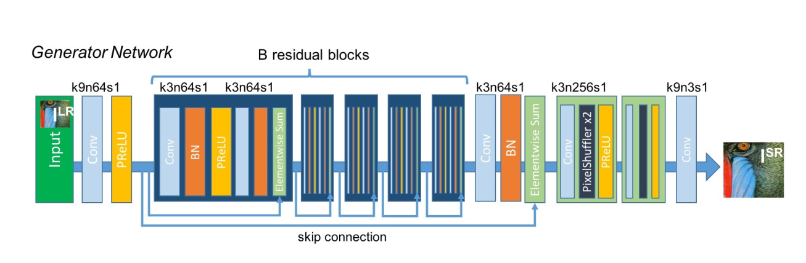
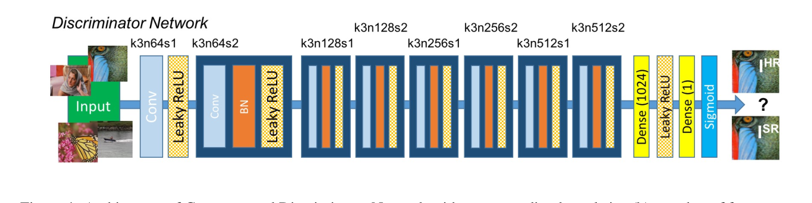
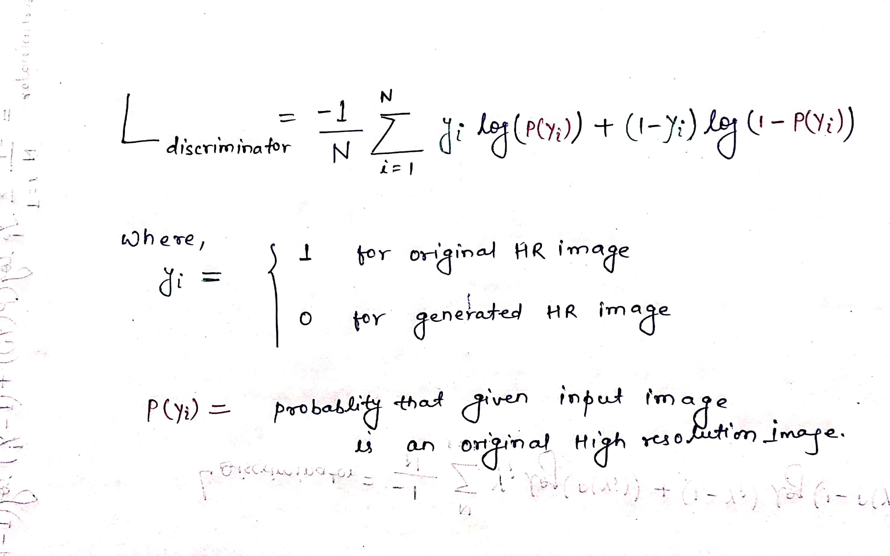
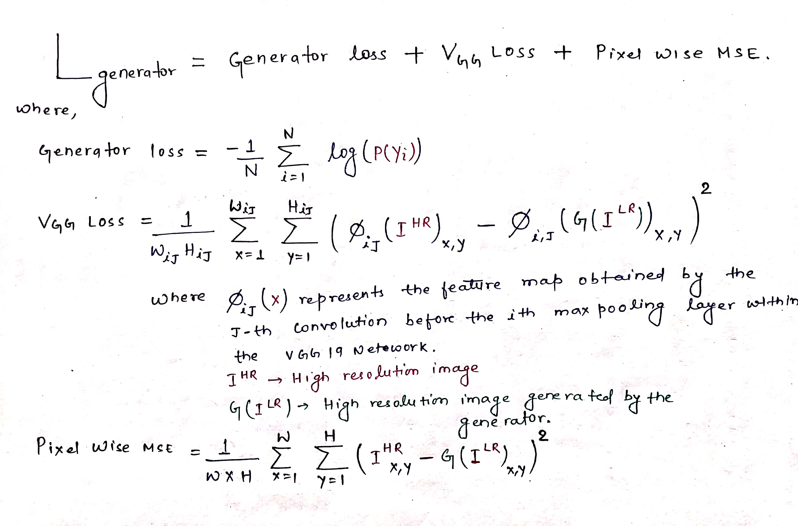
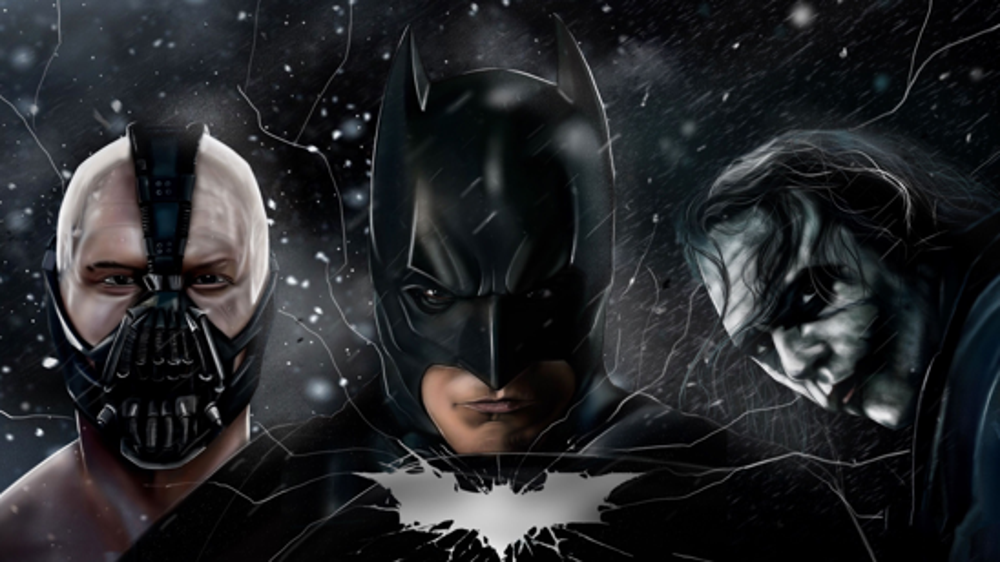
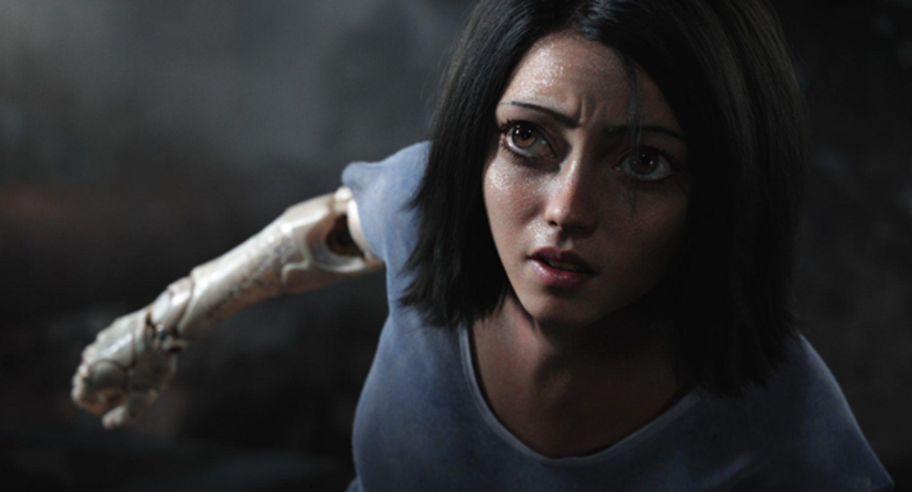
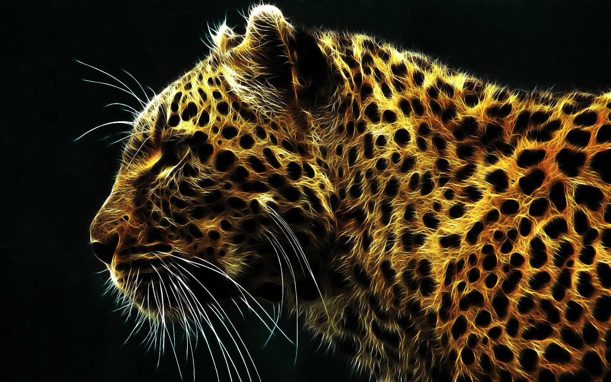

# Image-Super-Resolution-Using-a-Generative-Adversarial-Network

<h1>Content:</h1>
<a href="#obj" >1. Objective</a> 
<a href="#over" >2. Overview</a> 
<a href="#model" >3. Model Architecture</a> 
<a href="#loss" >4. Loss Function</a> 
<a href="#res" >5. Result</a> 
<a href="#app" >6. Appendix</a> 

<h1 id="obj">1. Objective:</h1>

<strong>The main objective of this project is to estimate a high-resolution, super-
resolved image from a low-resolution input image
</strong>
 
In this project I have  implemented the SRGAN described in the paper [Photo-Realistic Single Image Super-Resolution Using a Generative Adversial Network](https://arxiv.org/pdf/1609.04802.pdf)
Since it is emphasized in the paper that SRRESNET produces the less realistic 
and overly smooth image Compare to SRGAN so I focus mainly on implemanting SRGAN
instead of SRRESNET.

<h1 id="over">2. Overview: </h1>

<ul>
  <li>For training purpose I used CELEBA dataset and COCO dataset
  </li>
  <li>Here the low resolution version of its high resolution counter part is obtained by applying a Gaussian filter to High resolution
    image follwed by a downsampling factor r. For an image with C color channels, we describe Low Resolution image by W * H * C and       high resolution image and generated high resolution image by rW * rH * C. In our case r=4.
  </li>
  <li>
    Then the generating network is trained that estimates for a given  LR input image its correspondinng HR counterpart,  whose           parameter is obtained by optimizing a specific loss function mentioned in section 4.
  </li>
  <li>Model was trained on input dimension (3*64*64) and for multiple number of epochs (1000 epoch on CELEBA dataset and more than 1000 epoch on COCO Dataset.)</li>
  <li>I used Adam optimizer with intial learning rate = 0.0001 and change(reduce) it manually during training phase</li>
</ul>  

<h1 id="model">3. Model Architecture:</h1>
The generator and Discriminator Network used in this project is taken from <i>Goodfellow's Idea</i>:

<h4> Generator Network Architecture </h4>

<i> Here kxnysz represents: kernel size =(x,x), output_channels = y, and stride = z </i> 
<i>Activation Function: PReLU</i> 
<i>Output: Generated Super Resolution image which has 16x pixel compare to input image </i> 
<h5>PRelu :</h5>
It is a type of LeakyReLU whose slope is determined by neural network itself. We have used this activation function throughout the
Generator network block.

<h5>Batch Normalization</h5>
Batch normalization is a method used to make artificial neural networks faster and more stable through normalization of the input layer by re-centering and re-scaling.

<h5>Pixel Shuffler</h5>
The main objective of Pixel Shuffler is to convert the depth(channel) into space(height and width). Basically it is used to upsample the image size.
It rearrange the Tensor of shape (N,C,H,W) into (N,C/r*r,H*r,W*r) where r is the shuffling factor. In our case it was "2".

<h5> Discriminator Network Architecture </h5>

<i> Here kxnysz represents: kernel size =(x,x), output_channels = y, and stride = z </i>
<i>Activation function: Leaky Relu.</i> 
<i>Output: Probablity that  input image is original high resolution image</i>

<h1 id="loss">4. Loss Function:</h1>

The total loss function comprises of Discriminator loss function and generator loss function
 
<h5>Discriminator Loss Function: </h5>

<h5>Generator Loss Function</h5>

<strong>Note: </strong><i>I took i=4 and j=5.</i>
  
<h1 id="res">Result :</h1> 

The images in the following example are quite large.For better view click on the images to view it at its actual size

For every images the upper one is generated from the <strong>Bicubic InterPolation</strong> and lower one is generated from <strong>SRGAN model</strong>.

 

BICUBIC

SRGAN 

BICUBIC

SRGAN

BICUBIC

SRGAN

BICUBIC

SRGAN

<h1 id="app">Appendix :</h1>
<h5>Abbriviation used</h5>
<ul>
  <li>C : <i>Number of channels  in Input Image</i></li>
  <li>H : <i>Height of Input Image</i></li>
  <li>HRI : <i>High Resolution Image</i></li>
  <li>LRI : <i>Low  Resolution Image</i></li>
  <li>SRGAN : <i>Super Resolution Generative Adversarial Network</i></li>
  <li>SRI : <i>Super Resolved Image</i></li>
  <li>W  : <i>Width of Input Image</i></li>
</ul>
<h5>Refrence </h5>

[1] Christian Ledig, Lucas Theis, Ferenc Huszar, Jose Caballero, Andrew Cunningham, Alejandro Acosta, Andrew Aitken, Alykhan Tejani, Johannes Totz, Zehan Wang, Wenzhe Shi. Photo-Realistic Single Image Super-Resolution Using a Generative Adversarial Network.
 

[2]<a href="https://www.kaggle.com/jessicali9530/celeba-dataset">CelebFaces Attributes Dataset</a>

 

[3] Coco dataset

